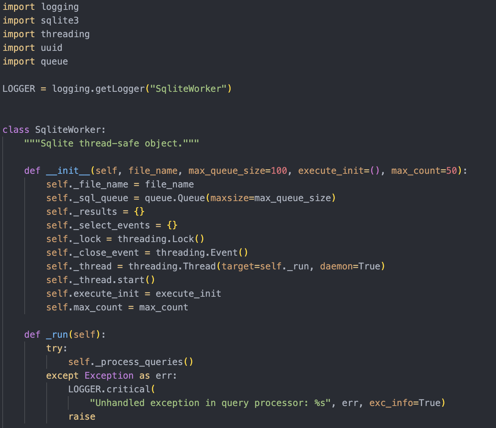

# DarkFusion



Dark Fusion is a custom Visual Studio Code theme that combines elements from Atom One Dark Pro, JetBrains' default theme, and Gruvbox, with enhanced Markdown support. It provides a visually appealing and comfortable coding experience.

## Features

- **Dark Background**: Deep dark grey/black background for reduced eye strain.
- **Soft Foreground**: Soft light grey foreground for excellent readability.
- **Enhanced Markdown Support**: Improved colors for headings, bold and italic text, links, code blocks, blockquotes, and lists.
- **Syntax Highlighting**: Vibrant colors for keywords, strings, functions, variables, types, and numbers.

## Installation

### Prerequisites

- **Node.js and npm**: Ensure you have Node.js and npm installed on your system.

### Steps

1. **Clone the Repository**:
   ```sh
   git clone git@github.com:roshanlam/DarkFusion.git
   cd dark-fusion-theme
   ```

2. Install vsce (Visual Studio Code Extension Manager)
    ```sh
    npm install -g vsce
    ```

3. Package the Theme
    ```sh
    vsce package
    ```

    This will create a .vsix file in the directory.

4. Install the Theme in Visual Studio Code:

* Open Visual Studio Code.
* Go to the Extensions view (Ctrl+Shift+X).
* Click on the three dots in the top-right corner and select Install from VSIX....
* Select the .vsix file you generated.

5. Activate the Theme:

* Open the Command Palette (Ctrl+Shift+P).
* Type Preferences: Color Theme and select "Dark Fusion" from the list.

